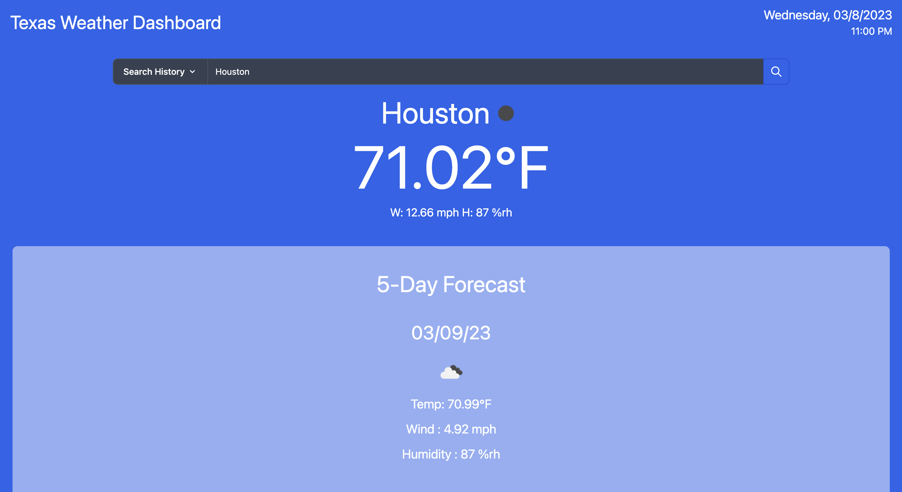

# Weather-Dashboard 

## Description 

A weather web app that displays the current weather information for your current location &amp; allows you to search for the weather information of any city in the great state of Texas! ⭐  

## Tool URL 

https://omar4589.github.io/Texas-WeatherDashboard/ 

## Instructions 

1. Type the name of a Texas city into the search bar 
2. Press the search button 🔍 

_Searched cities are saved to Local Storage_ 

If you have previous searches,   
    - Click the Search History button to view them   
    - Click a previously searched city to display it's weather information once again 

## Screenshot 

  
    
## License 
   
MIT License 

Copyright (c) 2022 Omar4589 

Permission is hereby granted, free of charge, to any person obtaining a copy
of this software and associated documentation files (the "Software"), to deal
in the Software without restriction, including without limitation the rights
to use, copy, modify, merge, publish, distribute, sublicense, and/or sell
copies of the Software, and to permit persons to whom the Software is
furnished to do so, subject to the following conditions: 

The above copyright notice and this permission notice shall be included in all
copies or substantial portions of the Software. 

THE SOFTWARE IS PROVIDED "AS IS", WITHOUT WARRANTY OF ANY KIND, EXPRESS OR
IMPLIED, INCLUDING BUT NOT LIMITED TO THE WARRANTIES OF MERCHANTABILITY,
FITNESS FOR A PARTICULAR PURPOSE AND NONINFRINGEMENT. IN NO EVENT SHALL THE
AUTHORS OR COPYRIGHT HOLDERS BE LIABLE FOR ANY CLAIM, DAMAGES OR OTHER
LIABILITY, WHETHER IN AN ACTION OF CONTRACT, TORT OR OTHERWISE, ARISING FROM,
OUT OF OR IN CONNECTION WITH THE SOFTWARE OR THE USE OR OTHER DEALINGS IN THE
SOFTWARE.
